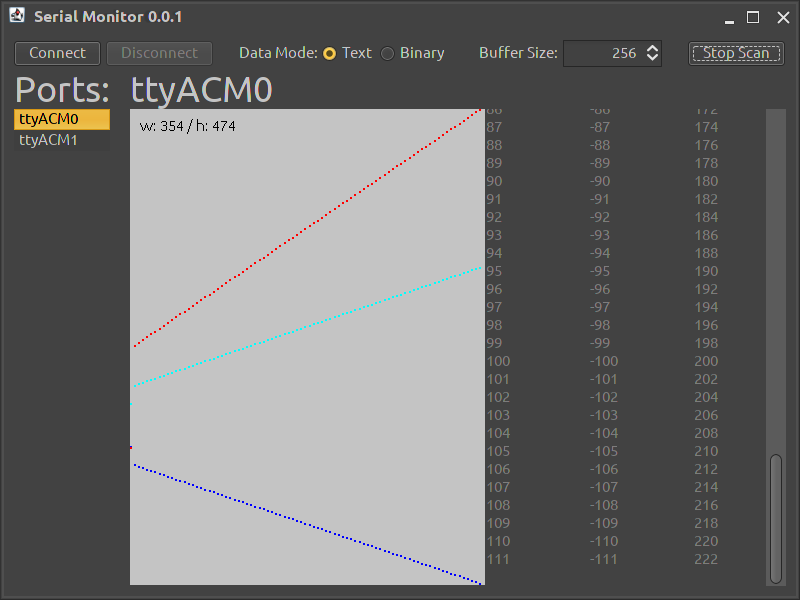

# serial-monitor

a small generic utility application to communicate with serial ports.
using a small swing user interface.
this is still under construction and is probably going to change a lot.
it also served as a prototype to understand basics of JSerialComm library and monocle library.
moreover it was the demo application during [my talk about optics](https://github.com/isaias-b/monocle-talk).
there are also some `DEMO` comments around in the code.
it has more an educational purpose.
however, there are still flaws within this application.




## technology stack

there are a bunch of libraries being used:

|technology        |usage                                  |
|------------------|---------------------------------------|
|jSerialComm       |portable serial communication          |
|monocle-core      |optics to update model                 |
|monocle-macro     |auto-generate optics                   |
|radiance-substance|substance Look&Feel for swing          |
|fs2-core          |queue for message passing              |
|fs2-io            |IO monad bindings for Queue            |
|cats-core         |traverse options and lists with IO     |
|cats-effect       |IO monad                               |


## architecture

swing code is inherently unsafe because side effects occur almost everywhere.
the application uses a self-made micro framework to wrap swing code.
`UI` is the central abstraction that takes care of the key features.
- maintain application State in an `MRef`
- maintain a queue of messages in an `fs2.Queue`
- maintain a list of views that subscribe to messages
- update model when new messages arrive
- announce model update to views 
- execute view updates on EDT (swings event dispatch thread)


## hardware

the application communicates with devices plugged into the machine.
during the demo 3 arduino compatible boards ([teensy 3.2](https://www.pjrc.com/store/teensy32.html)) have been used.
the code running on each of these 3 controllers had this shape:

```c
const int  sps            = 100;
const long serialRate     = 9600;
int counter = 0;

void setup() {
  pinMode(LED_BUILTIN, OUTPUT);
  SerialUSB.begin(serialRate);
}

void loop() {
  SerialUSB.read();
  SerialUSB.print(counter);
  SerialUSB.print('\t');
  SerialUSB.print(-counter);
  SerialUSB.print('\t');
  SerialUSB.print(2 * counter);
  SerialUSB.print('\n');
  counter = (counter + 1) % 256;
  digitalWrite(LED_BUILTIN, counter % 2 ? HIGH : LOW);
  delay(1000 / sps);
}
```


## data

such a device then acts as a sensor and therefore continuously streams data.
the format are newline separated rows and tab separated columns.
```text
0       -0       0
1       -1       2
2       -2       4
...
88      -88      176
89      -89      178
90      -90      180
...
254     -254     508
255     -255     510
0       -0       0
...
```
